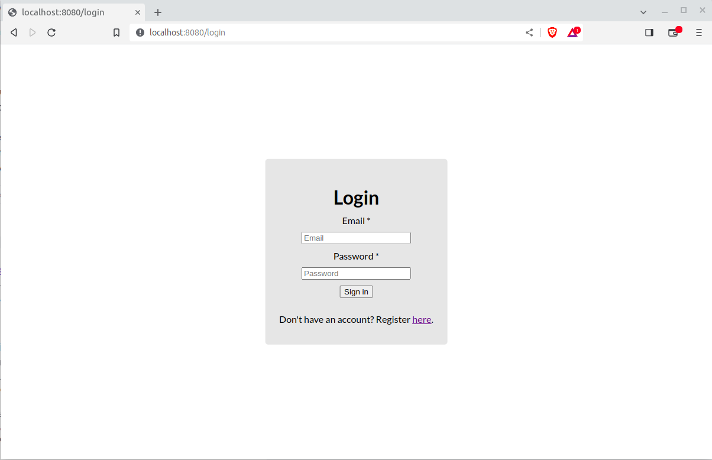
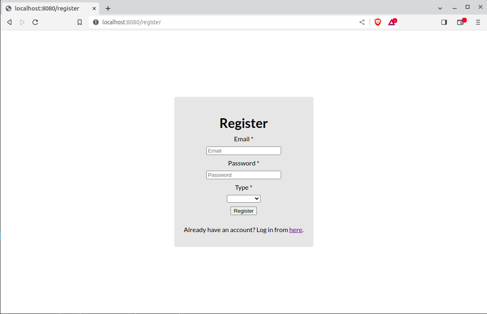
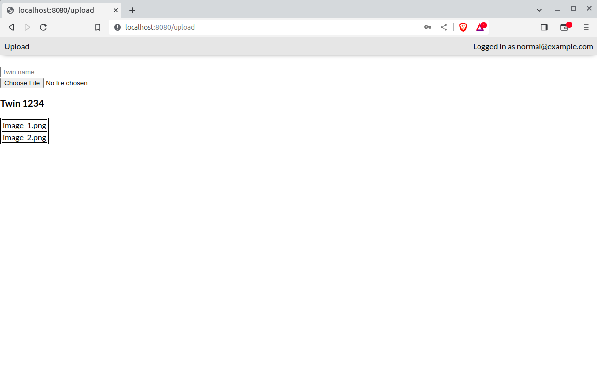

# Problem description
You are given a tiny app with 3 simple pages. 
Your job is to help us assert whether the behavior of the app is correct and how we could make it easy to test for unexpected changes.

# Project requirements

### Login page


1. The 'Login' page has the following fields and buttons:
- 'email' - alphanumeric email input field, required field
- 'password' - alphanumeric input field, required field
- 'Sign in' button
- Link to the 'Register' page with text: 'Don't have an account? Register here.'
2. On successful login, the user is redirected to the 'Upload' page.
3. If login is not successful, the user remains on the 'Login' page and you should get an UI notification.

Here is a list with the default registered users: 
```
const allUsers = [
    { email: 'normal@example.com',     password: 'normpass', type: 'normal' },
    { email: 'enterprise@example.com', password: 'entrpass', type: 'enterprise' },
];
```

### Register page


1. The 'Register' page has the following fields and buttons:
- 'email' - alphanumeric email input field, max length 50 characters, required field
- 'password' - character input field, min length 3 characters, required field
- 'type' - dropdown field with two options: ['normal', 'enterprise'] with default option 'normal'
- 'Register' button
- Link to the 'Login' page with text: 'Already have an account? Login here(Link on here).'
2. On successful registration, the user is redirected to the 'Login' page.
3. If registration is not successful, the user remains on the 'Registration' page and should get an UI notification.

### Upload page


1. The 'Upload' page has the following fields and buttons:
- 'Twin name' - alphanumeric input field, min length 3 characters, max length 50 characters, required field
- 'Choose File' button that navigates to the file system on the computer
2. If no file is selected - 'No file chosen' text is displayed next to the 'Choose File' button.
3. If no twin name is entered and the user tries to upload a file UI alert is received.
4. If file is selected from your computer - the name of the file and the file extension is displayed next to the 'Choose File' button. Only one file can be uploaded at a time.
5. On file select from your computer, the file is uploaded.
6. All uploaded files are visible on the 'Upload' page in a separate table for each twin.
7. The unique identifier of a twin is its name and adding files for the same twin name will add the file to the existing twin table.
8. 'enterprise' users can upload all file types.
9. 'normal' users can upload .jpeg files only. If 'normal' user tries to upload another file format, validation message is displayed
10. 'Logout' button - redirects to 'Login' page


# Your tasks:
1. Following the requirements, prepare some test cases for the app at your choice. You can group the test cases in test sets, if you like.

2. Did you manage to find some bugs? Please, report them with a nice and clear bug report. If you could not find a bug on the app, imagine there is one somewhere and create an example bug report.

3. Your last task is to write some automation tests that confirm the required behavior of the app. You can implement the tests in any way you want, but be prepared to explain your decision and the trade off it brings with it.

4. Give QA recommendation that will make the workflow better.

# System requirements
- [Node](https://nodejs.org/en)
- [Git](https://git-scm.com/downloads)

# Setup
```sh
$ git clone https://gitlab.myxrobotics.com/stanislav.nikolov/challenges
$ cd challenges/QA/src
$ npm install
$ node server.mjs
```

The server is now listening on [http://localhost:8080](http://localhost:8080).